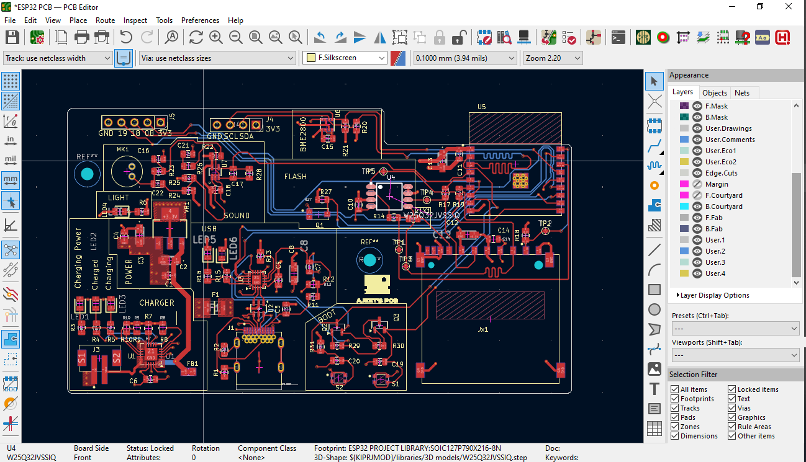

ESP32-C3 Based IoT PCB for Remote Sensing

This repository contains the complete design and documentation for a custom-built IoT PCB developed using the **ESP32-C3-02 SoC** and **TP4056 Li-ion charging IC**. Designed for sensor-based remote monitoring applications, the board integrates power management, display, logging, and modular expandability.

---

##  Key Features

- Microcontroller: ESP32-C3-02 (Wi-Fi + BLE support)
- Power Management: TP4056-based Li-ion charging with USB-C input
- Sensors:
  - BME280 (temperature, humidity, pressure)
  - Light sensor (TEMT6000)
  - Sound sensor (MAX4466)
- Peripherals:
  - I2C OLED display
  - microSD card for data logging
  - Flash memory chip (W25Q32)
- Power Input:
  - USB-C and LiPo battery support
- Form Factor: Compact, <100mm x 100mm
- Expansion: Modular headers for I2C/SPI sensors

---

## Folder Structure

```bash
ESP32_BASED_PCB-KiCAD/
├── GERBER/                    # Gerber and drill files for fabrication
├── Datasheets/               # Component datasheets (ICs, sensors, etc.)
├── libraries/                # Custom KiCad symbols, footprints, and 3D models
├── PICTURES/                 # Rendered PCB images and design snapshots
├── *.kicad_sch, *.kicad_pcb  # Schematic and PCB layout files
├── _autosave-*               # Backup files (can be ignored)
├── README.md                 # This file
├── .gitignore                # File exclusions
````

---

## Design Highlights

* Clean two-layer PCB layout with optimized signal routing
* Manual resolution of DRC/ERC issues in KiCad
* Verified using DFM rules for manufacturability
* Signal integrity maintained across I2C/SPI
* Modular architecture for ease of debugging and expansion
* Custom footprint creation for several unique parts

---

## Preview




---

## Getting Started

To replicate or adapt this design:

1. Clone this repo:

   ```bash
   git clone https://github.com/BitwiseAjeet/ESP32_BASED_PCB-KiCAD.git
   ```

2. Open the KiCad project file:

   * `ESP32 PCB.kicad_pro`

3. Explore the schematic (`.kicad_sch`) and layout (`.kicad_pcb`)

4. Export Gerbers and BOM using KiCad's plot function for manufacturing

---

##  License

This project is licensed under the [MIT License](LICENSE) – feel free to use, modify, or contribute.

---

🙋‍♂️ Author

**Ajeet Kumar**
[LinkedIn](https://www.linkedin.com/in/ajeet-mishra-296153242) | [GitHub](https://github.com/BitwiseAjeet)

---

 💡 Contributions Welcome!

If you spot issues or want to build on this project, feel free to open an [Issue](https://github.com/BitwiseAjeet/ESP32_BASED_PCB-KiCAD/issues) or submit a pull request.
